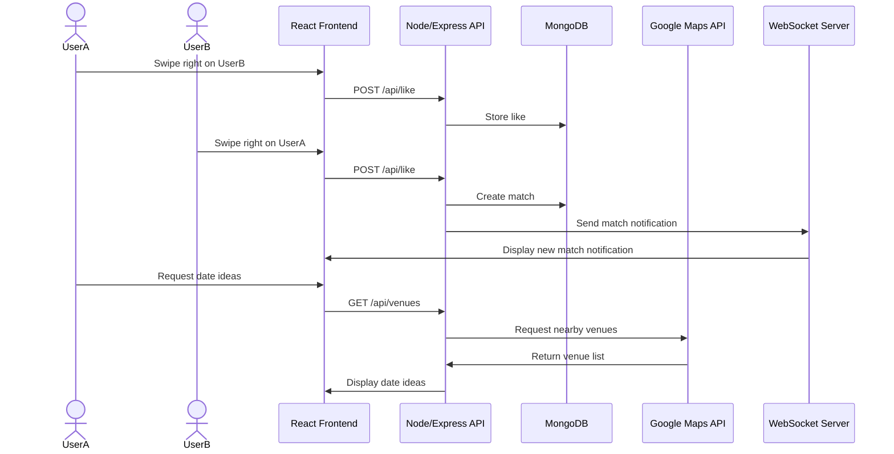

# Debrief Architecture Overview

## Project Description

Debrief is a React single-page dating app concept focused on learning from real date outcomes. Users can discover profiles, sign up, match, chat, propose dates, and eventually submit private post-date debriefs that will feed a compatibility system.

## Current Frontend Structure

The app is bundled with Vite and rendered through React. `vite.config.js` proxies `/api/*` to the Express server (see Backend below) so `fetch` calls work unchanged in dev without CORS.

```text
index.html
vite.config.js
deployReact.sh
.env                    (gitignored, AWS credentials)
src/
├── main.jsx
├── App.jsx
├── App.css
├── index.css
├── components/
│   ├── AppNav.jsx
│   └── Footer.jsx
├── context/
│   ├── AuthContext.jsx
│   └── ProtectedRoute.jsx
└── pages/
    ├── Home/
    │   ├── Home.jsx
    │   └── Home.css
    ├── Signup/
    │   ├── Signup.jsx
    │   ├── dateUtils.js
    │   └── steps/
    │       ├── AccountStep.jsx
    │       ├── IdentityStep.jsx
    │       ├── BasicInfoStep.jsx
    │       ├── MoreInfoStep.jsx
    │       └── PhotosStep.jsx
    ├── Discover/
    │   └── Discover.jsx
    ├── Chat/
    │   └── Chat.jsx
    └── Profile/
        └── Profile.jsx
server/
├── index.js            (mounts everything below, serves static build + SPA fallback)
├── auth.js              (POST/PUT/DELETE /api/auth, GET /api/user/me)
├── authHelpers.js        (shared cookie -> user lookup)
├── discover.js           (GET /api/discover)
├── dbClient.js
├── s3Client.js
├── userSchema.js
├── package.json          (backend-only deps, separate from the root package.json)
├── seedTestUsers.js
├── seedAdminUser.js
├── clearTestUsers.js
├── testDbConnection.js
└── testS3Connection.js
```

## Routing

React Router handles navigation inside `src/App.jsx`, wrapped in an `AuthProvider` (`src/context/AuthContext.jsx`).

- `/` renders the Home page (public).
- `/signup` renders the Signup wizard (public, all 5 steps live under this one route).
- `/discover`, `/chat`, `/profile`, `/liked` are each wrapped in `ProtectedRoute` (`src/context/ProtectedRoute.jsx`) - it reads `useAuth()`, renders nothing while the initial session check is loading (avoids a flash-redirect for an already-logged-in user), and redirects to `/` if there's no user.

### AuthContext

`src/context/AuthContext.jsx` is the single source of truth for "am I logged in" on the frontend. On mount it calls `GET /api/user/me` once to pick up an existing session cookie (so a page refresh doesn't wrongly bounce a logged-in user to Home). It exposes `login(email)` / `logout()` setters that `Home.jsx`, `Signup.jsx`, and `AppNav.jsx` call directly after their own fetch calls succeed, instead of waiting on a second round-trip to re-check the session.

## Pages

### Home

`src/pages/Home/Home.jsx` contains the landing page, product messaging, real images, and a working login form (`PUT /api/auth`) that calls `AuthContext.login()` and navigates to `/discover` on success, or shows an inline error on a 401.

### Signup

`src/pages/Signup/Signup.jsx` is a single-page, 5-step wizard (not separate routes). It owns one `formData` object and a `step` counter; each step (`steps/AccountStep.jsx`, `IdentityStep.jsx`, `BasicInfoStep.jsx`, `MoreInfoStep.jsx`, `PhotosStep.jsx`) is a presentational component that reads/writes a slice of that shared state. `dateUtils.js` computes age and zodiac sign live from the birthday entered in step 1. The wizard's single `<form>` means the browser's native `required` validation only ever checks the currently-visible step's fields. On the final "Finish" submit, it does two sequential requests: `POST /api/signup` (multipart, the profile fields + photos, no password) and then `POST /api/auth` (JSON, email + password) to register credentials on that same profile document and log the new user in, before navigating to `/discover`.

### Discover

`src/pages/Discover/Discover.jsx` fetches `GET /api/discover` on mount and shows one real profile at a time (name, age, hometown, job title, a landscape placeholder photo). "Like"/"Nope" just advance to the next profile locally - there's no `/api/like` endpoint yet, so nothing is persisted. Loading/error/empty states are handled inline. The venue-suggestions and WebSocket-notifications sections are still text placeholders.

### Chat

`src/pages/Chat/Chat.jsx` is mocked out with local `useState`/`useEffect` (no backend) but structurally matches the intended real design (see Planned: Chat below):

- A match list grouped into "Your turn" / "Their turn", derived from whichever side sent the last message in each thread - not stored, so it can't drift out of sync with the thread itself.
- Clicking a match opens the full thread, with a "View profile" toggle (mocked profile panel: photo, age, job, hometown) and a "Plan a date" toggle (mocked venue suggestions, standing in for a future server-side Google Maps call).
- Sending a message appends it to that match's thread and triggers a delayed mock reply, which also flips the match's turn-grouping live.

### Profile

`src/pages/Profile/Profile.jsx` is also mocked with local `useState`, modeled on Hinge's own profile/edit screen rather than a plain form:

- A circular photo avatar with a working local file-picker preview (`URL.createObjectURL`, no upload) and an edit-pencil overlay.
- The real logged-in email from `AuthContext` (not mocked) displayed under the name.
- Three grouped field lists - **My Vitals**, **Identity**, **My Virtues** - whose keys match `USER_FIELDS` in `server/userSchema.js` exactly, so this maps onto real profile data once a `GET`/`PATCH /api/profile` endpoint exists. Each row is tap-to-edit inline plus a Visible/Hidden toggle; `Name`/`Age`/`Height`/`Location` are locked "Always Visible" and `interested_in` is locked "Always Hidden", matching Hinge. The visibility toggle is UI-only right now - nothing downstream (e.g. Discover) reads it.

#### Planned: Chat

The current Chat page is a single flat thread mocked with local state, restyled to the grouped match-list structure above. The still-planned real version:

- **Match list** - `/chat` shows matches with their photo, name, and a preview of the most recent message (whichever side sent it) - built, but backed by local mock data instead of a `matches` collection.
- **Thread view** - clicking a match opens the full conversation for just that match - built, mocked.
- **Date planning** - the "Plan a date" button opens date planning, which should call the Google Maps Places API server-side to suggest nearby venues (see `GET /api/venues` in the data flow diagram below) - this is a normal REST call, not WebSocket. Currently shows a hardcoded venue list instead.
- **Live delivery** - new messages and date-proposal updates should be pushed over WebSocket rather than polled, so a thread updates while it's open. Currently simulated with a client-side `setTimeout`.

Backend work this needs (see Future Backend below): a `matches`/`messages` collection in MongoDB, REST endpoints for the match list and thread history, a `POST` endpoint for sending a message, and a WebSocket server for pushing new messages/proposals to open threads.

## Backend

A Node/Express server (`server/index.js`) exposes (Mongo credentials live in `server/dbConfig.json`, gitignored, loaded by `server/dbClient.js`):

- **`POST /api/signup`** — accepts the signup wizard's `multipart/form-data` submission via Multer (`memoryStorage`, image-only `fileFilter`, 8 files / 8MB each max; no minimum photo count is enforced). It generates one `ObjectId` used as both the Mongo `_id` and the S3 key prefix (`photos/{id}/{n}.{ext}`), uploads each photo to S3 (`server/s3Client.js`), then inserts one document into MongoDB's `users` collection (`server/dbClient.js`) with the uploaded `photoKeys` attached. `server/userSchema.js` exports `USER_FIELDS`, an allow-list used to pick fields out of the request body rather than spreading it directly into the Mongo insert - `password`/`token` are deliberately excluded from that list, since they're written directly by `auth.js`, not through client-controlled signup fields.
- **`POST /api/auth`, `PUT /api/auth`, `DELETE /api/auth`, `GET /api/user/me`** (`server/auth.js`) — registration, login, logout, and the "who am I" restricted endpoint, matching the BYU CS 260 Login deliverable contract. Passwords are bcrypt-hashed (`bcryptjs`); sessions are a random `uuid` token stored on the user's own document and sent back as an `httpOnly`/`secure`/`sameSite: strict` cookie (`cookie-parser`). Credentials live on the *same* `users` document the signup wizard creates (matched by `email`), not a separate collection, so `POST /api/auth` only 409s when that document already has a `password` set - a bare profile doc with no credentials yet (the normal case right after signup) is fair game to register against. `server/authHelpers.js` holds the shared `getAuthenticatedUser(req)` cookie → user lookup, used by both `auth.js` and `discover.js`.
- **`GET /api/discover`** (`server/discover.js`) — requires a valid session (401 otherwise), returns every *other* user's basic info (name, age, location, hometown, job_title, photoKeys) via a Mongo projection that excludes email/phone/password/token.
- **Static frontend + SPA fallback** — `express.static` serves a built React bundle from `../public` (sibling to `server/`, populated by `deployReact.sh` in production; this directory doesn't exist in local dev, where Vite serves the frontend instead and proxies `/api` over). Any unmatched `GET` falls back to that bundle's `index.html` so React Router's client-side routes resolve correctly.
- `server/testDbConnection.js` / `server/testS3Connection.js` (`npm run test:db` / `npm run test:s3`) independently verify the Mongo and S3 connections outside of the app.

### Dev data / seeding

- `npm run seed:users` — `server/seedTestUsers.js` creates 10 fake profiles through the real `POST /api/signup` route (not a direct Mongo insert), so they get the exact same validation, S3 upload, and document shape as a real signup.
- `npm run seed:admin` — `server/seedAdminUser.js` upserts a single `admin@gmail.com` profile directly into Mongo (no photos). Its password is registered through the real `POST /api/auth` flow, not seeded directly.
- `npm run seed:clear` — `server/clearTestUsers.js` deletes the seeded test users (matched by `@example.com` email) and their S3 photos.

## Planned Data Flow

Signup, auth, and `GET /api/discover` (above) are implemented. Matching/likes, chat, date proposals, and debriefs below are still planned.



## Future Backend

`POST /api/signup`, the auth endpoints, and `GET /api/discover` (see Backend above) are built. Still planned as Node/Express additions:

- REST endpoints for likes, matches, date proposals, and debrief submissions.
- MongoDB storage for matches, messages, proposals, and coach-reviewed debriefs (users/profiles storage and credentials are done).
- A `GET`/`PATCH /api/profile` endpoint so `Profile.jsx` can load and save real data instead of local mock state.
- WebSocket support for live chat, match notifications, and date proposal updates.
- Server-side Google Maps API calls for venue suggestions.

## Deployment

Production runs on a shared EC2 box behind Caddy, at **`startup.debrief.works`** (per the CS 260 course convention - not the bare `debrief.works` domain, which is unrelated/unused for now and switches over at the end of the class). Caddy reverse-proxies that subdomain to `localhost:4000`, managed by `pm2` as the `startup` process.

- **Layout on the box** (`~/services/startup/`): `public/` (the built React bundle, pushed by `deployReact.sh -s startup`), `.env` (production AWS credentials, `600` permissions, gitignored, never in the static-served directory so it's unreachable over HTTP), and `server/` (this repo's backend code plus its own `node_modules`, installed from `server/package.json` so the frontend toolchain never has to be installed on the box) - `server/dbConfig.json` (production Mongo credentials, `600` permissions, gitignored) lives inside that `server/` directory, not at the `~/services/startup/` top level.
- **Process**: `pm2 start server/index.js --name startup --node-args="--env-file=.env"`, run from `~/services/startup` so path resolution (`../public`) matches the local repo layout exactly. `pm2 save` persists it across a reboot.
- **Deploying frontend-only changes**: `npm run build && ./deployReact.sh -k ~/keys/production.pem -h debrief.works -s startup`.
- **Deploying backend changes**: copy the updated `server/*.js` files + `server/package.json` to `~/services/startup/server/`, `npm install` there, `pm2 restart startup`. `server/dbConfig.json` itself isn't part of this routine copy - it's a one-time secret placed directly on the box, not tracked in this repo.
- A separate, unrelated `simon.debrief.works` (a different course project) runs alongside this on the same pm2/Caddy setup and is never touched by the above.

## Current Limitations

- Chat and Profile are fully mocked with local React state - no backend, no persistence, no real matches/messages/profile data.
- No likes/matches backend - Discover's "Like"/"Nope" don't persist anywhere.
- WebSocket notifications and third-party venue (Google Maps) data are still placeholders/mocked.
- No `GET`/`PATCH /api/profile` endpoint, so a user can't yet load or save their own real profile data (Profile.jsx mocks this).
- The Profile page's Visible/Hidden field toggle is UI-only - nothing enforces it anywhere (e.g. Discover doesn't filter on it).
- "Liked me" is a route placeholder.
- Dev and production currently share the same Mongo/AWS credentials (a deliberate simplification for now, not separate environments).
