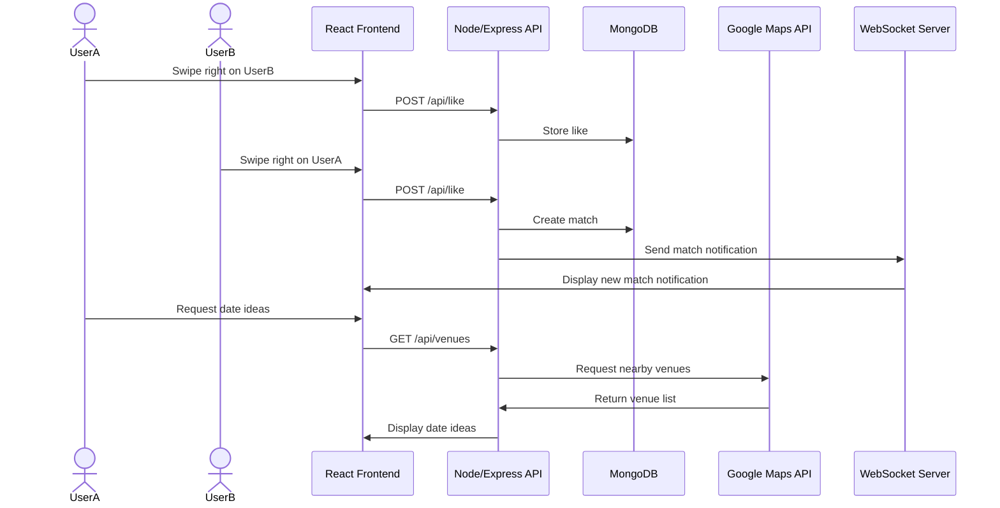

# Debrief Architecture Overview

## Project Description

Debrief is a React single-page dating app concept focused on learning from real date outcomes. Users can discover profiles, sign up, match, chat, propose dates, and eventually submit private post-date debriefs that will feed a compatibility system.

## Current Frontend Structure

The app is bundled with Vite and rendered through React.

```text
index.html
src/
├── main.jsx
├── App.jsx
├── App.css
├── index.css
└── pages/
    ├── Home/
    │   └── Home.jsx
    ├── Signup/
    │   └── Signup.jsx
    └── Discover/
        └── Discover.jsx
```

## Routing

React Router handles navigation inside `src/App.jsx`.

- `/` renders the Home page.
- `/signup` renders the Signup page.
- `/discover` renders the Discover page.
- `/liked`, `/chats`, and `/profile` currently render placeholder pages for future features.

## Pages

### Home

`src/pages/Home/Home.jsx` contains the landing page, login placeholder dialog, product messaging, and a real image element for the Debrief design concept.

### Signup

`src/pages/Signup/Signup.jsx` contains semantic registration forms. It uses `fieldset`, `legend`, `label`, `input`, and `select` elements to organize basic information, identity selections, and additional profile details.

### Discover

`src/pages/Discover/Discover.jsx` contains a profile card placeholder, like/dislike controls, app navigation, a future Google Maps venue placeholder, a future database profile placeholder, and a future WebSocket notifications placeholder.

## Planned Data Flow



## Future Backend

The backend is planned as a Node/Express service with:

- REST endpoints for profiles, likes, matches, date proposals, and debrief submissions.
- MongoDB storage for users, profiles, matches, messages, proposals, and coach-reviewed debriefs.
- Authentication with hashed credentials.
- WebSocket support for live chat, match notifications, and date proposal updates.
- Server-side Google Maps API calls for venue suggestions.

## Current Limitations

- Login, database records, WebSocket notifications, and third-party venue data are represented by placeholders.
- Liked me, Chats, and Profile are route placeholders.
- Styling is still minimal and will be expanded in the CSS deliverable.
