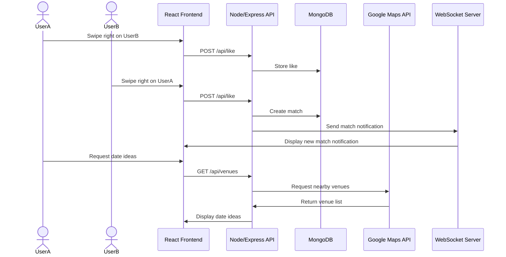

# Debrief Architecture Overview

## Project Description

Debrief is a React single-page dating app concept focused on learning from real date outcomes. Users can discover profiles, sign up, match, chat, propose dates, and eventually submit private post-date debriefs that will feed a compatibility system.

## Current Frontend Structure

The app is bundled with Vite and rendered through React. `vite.config.js` proxies `/api/*` to the Express server (see Backend below) so `fetch` calls work unchanged in dev without CORS.

```text
index.html
vite.config.js
src/
├── main.jsx
├── App.jsx
├── App.css
├── index.css
├── components/
│   ├── AppNav.jsx
│   └── Footer.jsx
└── pages/
    ├── Home/
    │   └── Home.jsx
    ├── Signup/
    │   ├── Signup.jsx
    │   ├── dateUtils.js
    │   └── steps/
    │       ├── AccountStep.jsx
    │       ├── IdentityStep.jsx
    │       ├── BasicInfoStep.jsx
    │       ├── MoreInfoStep.jsx
    │       └── PhotosStep.jsx
    ├── Discover/
    │   └── Discover.jsx
    ├── Chat/
    │   └── Chat.jsx
    └── Profile/
        └── Profile.jsx
server/
├── index.js
├── dbClient.js
├── s3Client.js
├── userSchema.js
├── testDbConnection.js
└── testS3Connection.js
```

## Routing

React Router handles navigation inside `src/App.jsx`.

- `/` renders the Home page.
- `/signup` renders the Signup wizard (all 5 steps live under this one route).
- `/discover` renders the Discover page.
- `/chat` renders the Chat page.
- `/profile` renders the Profile page.
- `/liked` currently renders a placeholder page for a future feature.

## Pages

### Home

`src/pages/Home/Home.jsx` contains the landing page, login placeholder dialog, product messaging, and real images for the Debrief design concept.

### Signup

`src/pages/Signup/Signup.jsx` is a single-page, 5-step wizard (not separate routes). It owns one `formData` object and a `step` counter; each step (`steps/AccountStep.jsx`, `IdentityStep.jsx`, `BasicInfoStep.jsx`, `MoreInfoStep.jsx`, `PhotosStep.jsx`) is a presentational component that reads/writes a slice of that shared state. `dateUtils.js` computes age and zodiac sign live from the birthday entered in step 1 — both are read-only in the UI and can only change by editing the birthday. The wizard's single `<form>` means the browser's native `required` validation only ever checks the currently-visible step's fields. Nothing is sent to the server until the final "Finish" submit on step 5, which posts every field plus the uploaded photo files together as one `multipart/form-data` request to `POST /api/signup`.

### Discover

`src/pages/Discover/Discover.jsx` contains a profile card placeholder, like/dislike controls, app navigation, a future Google Maps venue placeholder, a future database profile placeholder, and a future WebSocket notifications placeholder.

### Chat / Profile

`src/pages/Chat/Chat.jsx` and `src/pages/Profile/Profile.jsx` are still placeholder pages (conversation view and profile details are not yet wired to real data).

## Backend

A Node/Express server (`server/index.js`) exposes one endpoint so far:

- **`POST /api/signup`** — accepts the signup wizard's `multipart/form-data` submission via Multer (`memoryStorage`, image-only `fileFilter`, 8 files / 8MB each max, server-side re-check that at least 3 photos were uploaded). It generates one `ObjectId` used as both the Mongo `_id` and the S3 key prefix (`photos/{id}/{n}.{ext}`), uploads each photo to S3 (`server/s3Client.js`, credentials from `.env`, `@aws-sdk/client-s3`), then inserts one document into MongoDB's `users` collection (`server/dbClient.js`, credentials from `dbConfig.json`) with the uploaded `photoKeys` attached.
- **`server/userSchema.js`** documents the `users` document shape and exports `USER_FIELDS`, an allow-list used to pick fields out of the request body rather than spreading it directly into the Mongo insert. **`password` is deliberately excluded** — the client never sends it to this endpoint, and it is never persisted. Hashing and storing credentials (bcrypt) is scoped to the separate auth/Service deliverable, not yet built.
- `server/testDbConnection.js` / `server/testS3Connection.js` (run via `npm run test:db` / `npm run test:s3`) independently verify the Mongo and S3 connections outside of the app.

## Planned Data Flow

The signup → S3 → MongoDB flow above is implemented. Matching, chat, date proposals, and debriefs below are still planned.



## Future Backend

`POST /api/signup` (see Backend above) is built. Still planned as Node/Express additions:

- Authentication endpoints (register/login/logout) with bcrypt-hashed credentials, plus a restricted/session-gated endpoint.
- REST endpoints for likes, matches, date proposals, and debrief submissions.
- MongoDB storage for matches, messages, proposals, and coach-reviewed debriefs (users/profiles storage is done).
- WebSocket support for live chat, match notifications, and date proposal updates.
- Server-side Google Maps API calls for venue suggestions.

## Current Limitations

- No authentication yet — there's no login, no sessions, and passwords aren't collected server-side at all (see Backend above). Signup creates a profile document but not an account you can log into.
- Discover's profile card, and the Chat and Profile pages, are still placeholders — no real matches, messages, or profile data are loaded yet.
- WebSocket notifications and third-party venue (Google Maps) data are still placeholders.
- "Liked me" is a route placeholder.
- Styling is still minimal and will be expanded in the CSS deliverable.
